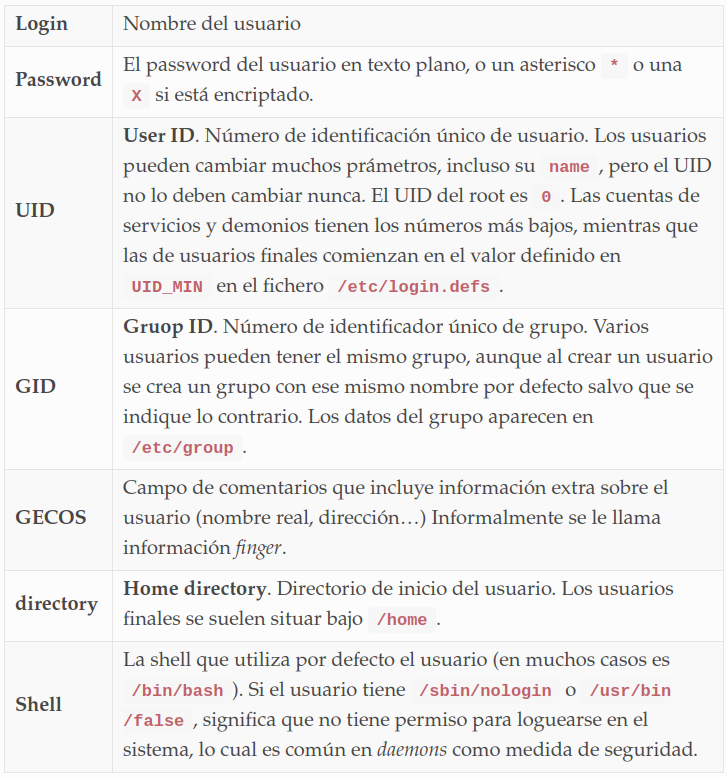
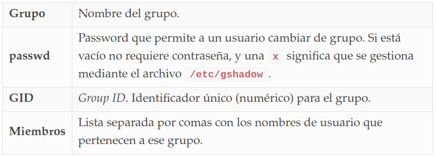
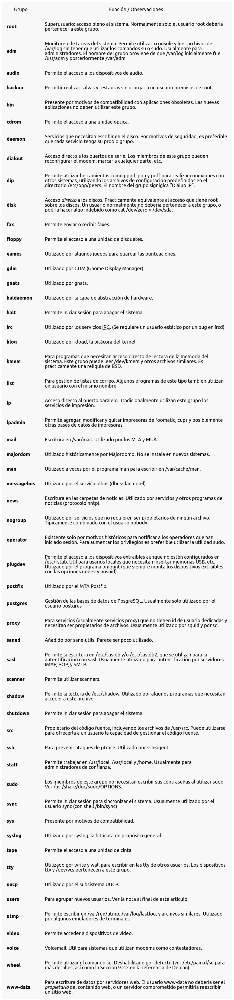

Resuelve los siguientes apartados en la máquina virtual de GNU/Linux. Cuando se pregunte por qué comando se utilizaría, debes indicar el comando completo, con las opciones y parámetros necesarios para que funcione:

1. Muestra todos los usuarios de tu máquina virtual. ¿Dónde está esa información? ¿Qué datos guarda el sistema sobre sus usuarios y cómo se organizan?
```
cat /etc/passwd
```
- La información se encuentra en la carpeta **/etc/passwd.**

- Campos de **passwd:**
<div align="center">

</div>

2. ¿Por qué hay tantos usuarios? De todos ellos, ¿cuáles realmente pueden abrir una consola de comandos? ¿cuáles podrían inciar una sesión con una contraseña válida? ¿Cómo sabes estos datos? ¿Por qué crees que es así?
```
alejandro@xubuurano11:~$ cat /etc/passwd
root:x:0:0:root:/root:/bin/bash
daemon:x:1:1:daemon:/usr/sbin:/usr/sbin/nologin
bin:x:2:2:bin:/bin:/usr/sbin/nologin
sys:x:3:3:sys:/dev:/usr/sbin/nologin
sync:x:4:65534:sync:/bin:/bin/sync
games:x:5:60:games:/usr/games:/usr/sbin/nologin
man:x:6:12:man:/var/cache/man:/usr/sbin/nologin
lp:x:7:7:lp:/var/spool/lpd:/usr/sbin/nologin
mail:x:8:8:mail:/var/mail:/usr/sbin/nologin
news:x:9:9:news:/var/spool/news:/usr/sbin/nologin
uucp:x:10:10:uucp:/var/spool/uucp:/usr/sbin/nologin
proxy:x:13:13:proxy:/bin:/usr/sbin/nologin
www-data:x:33:33:www-data:/var/www:/usr/sbin/nologin
backup:x:34:34:backup:/var/backups:/usr/sbin/nologin
list:x:38:38:Mailing List Manager:/var/list:/usr/sbin/nologin
irc:x:39:39:ircd:/run/ircd:/usr/sbin/nologin
gnats:x:41:41:Gnats Bug-Reporting System (admin):/var/lib/gnats:/usr/sbin/nologin
nobody:x:65534:65534:nobody:/nonexistent:/usr/sbin/nologin
systemd-network:x:100:102:systemd Network Management,,,:/run/systemd:/usr/sbin/nologin
systemd-resolve:x:101:103:systemd Resolver,,,:/run/systemd:/usr/sbin/nologin
systemd-timesync:x:102:104:systemd Time Synchronization,,,:/run/systemd:/usr/sbin/nologin
messagebus:x:103:106::/nonexistent:/usr/sbin/nologin
syslog:x:104:110::/home/syslog:/usr/sbin/nologin
_apt:x:105:65534::/nonexistent:/usr/sbin/nologin
tss:x:106:111:TPM software stack,,,:/var/lib/tpm:/bin/false
uuidd:x:107:114::/run/uuidd:/usr/sbin/nologin
tcpdump:x:108:116::/nonexistent:/usr/sbin/nologin
avahi-autoipd:x:109:117:Avahi autoip daemon,,,:/var/lib/avahi-autoipd:/usr/sbin/nologin
usbmux:x:110:46:usbmux daemon,,,:/var/lib/usbmux:/usr/sbin/nologin
rtkit:x:111:118:RealtimeKit,,,:/proc:/usr/sbin/nologin
dnsmasq:x:112:65534:dnsmasq,,,:/var/lib/misc:/usr/sbin/nologin
cups-pk-helper:x:113:121:user for cups-pk-helper service,,,:/home/cups-pk-helper:/usr/sbin/nologin
lightdm:x:114:122:Light Display Manager:/var/lib/lightdm:/bin/false
speech-dispatcher:x:115:29:Speech Dispatcher,,,:/run/speech-dispatcher:/bin/false
avahi:x:116:124:Avahi mDNS daemon,,,:/var/run/avahi-daemon:/usr/sbin/nologin
kernoops:x:117:65534:Kernel Oops Tracking Daemon,,,:/:/usr/sbin/nologin
saned:x:118:126::/var/lib/saned:/usr/sbin/nologin
hplip:x:119:7:HPLIP system user,,,:/run/hplip:/bin/false
whoopsie:x:120:127::/nonexistent:/bin/false
colord:x:121:128:colord colour management daemon,,,:/var/lib/colord:/usr/sbin/nologin
pulse:x:122:129:PulseAudio daemon,,,:/var/run/pulse:/usr/sbin/nologin
systemd-coredump:x:999:999:systemd Core Dumper:/:/usr/sbin/nologin
vboxadd:x:998:1::/var/run/vboxadd:/bin/false
fwupd-refresh:x:123:135:fwupd-refresh user,,,:/run/systemd:/usr/sbin/nologin
alejandro:x:1001:1001:Alejandro Hernandez,,,:/home/alejandro:/bin/bash
geoclue:x:124:136::/var/lib/geoclue:/usr/sbin/nologin
mysql:x:125:137:MySQL Server,,,:/nonexistent:/bin/false
```
3. Fíjate en el UID de los usuarios. ¿Ves alguna diferencia entre los usuarios con UID < 1000 y los que tiene un UID >= 1000? ¿Por qué es así?
- Por debajo de 1000 se reservan para el sistema, por encima para usuarios "normales".
4. Muestra todos los grupos de tu máquina virtual. ¿Dónde está esa información? ¿Qué datos guarda el sistema sobre sus grupos y cómo se organizan?
- Se encuentra en la carpeta **/etc/group.**
```
alejandro@xubuurano11:~/Repositorios/sistemas-informaticos/scripts_linux$ cat /etc/group
root:x:0:
daemon:x:1:
bin:x:2:
sys:x:3:
adm:x:4:syslog
tty:x:5:syslog
disk:x:6:
lp:x:7:
mail:x:8:
news:x:9:
uucp:x:10:
man:x:12:
proxy:x:13:
kmem:x:15:
dialout:x:20:
fax:x:21:
voice:x:22:
cdrom:x:24:
floppy:x:25:
tape:x:26:
sudo:x:27:alejandro
audio:x:29:pulse
dip:x:30:
www-data:x:33:
backup:x:34:
operator:x:37:
list:x:38:
irc:x:39:
src:x:40:
gnats:x:41:
shadow:x:42:
utmp:x:43:
video:x:44:
sasl:x:45:
plugdev:x:46:
staff:x:50:
games:x:60:
users:x:100:
nogroup:x:65534:
systemd-journal:x:101:
systemd-network:x:102:
systemd-resolve:x:103:
systemd-timesync:x:104:
crontab:x:105:
messagebus:x:106:
input:x:107:
kvm:x:108:
render:x:109:
syslog:x:110:
tss:x:111:
bluetooth:x:112:
ssl-cert:x:113:
uuidd:x:114:
mlocate:x:115:
tcpdump:x:116:
avahi-autoipd:x:117:
rtkit:x:118:
netdev:x:120:
lpadmin:x:121:
lightdm:x:122:
nopasswdlogin:x:123:
avahi:x:124:
scanner:x:125:saned
saned:x:126:
whoopsie:x:127:
colord:x:128:
pulse:x:129:
pulse-access:x:130:
lxd:x:131:
sambashare:x:132:
systemd-coredump:x:999:
vboxsf:x:998:
sgx:x:133:
plocate:x:134:
_ssh:x:119:
fwupd-refresh:x:135:
alejandro:x:1001:
geoclue:x:136:
mysql:x:137:
docker:x:138:
```
- Guarda la siguiente información:
<div align="center">

</div>
5. ¿Por qué hay tantos grupos? Intenta buscar información sobre qué funciones tienen los diferentes grupos de tu sistema, en los apuntes hay un enlace con algo de información.
<div align="center">

</div>

6. ¿Cómo comprobarías si un usuario existe ya en el sistema? ¿Y un grupo?
```
alejandro@xubuurano11:~$ id alejandro
uid=1001(alejandro) gid=1001(alejandro) grupos=1001(alejandro),27(sudo)
```
```
alejandro@xubuurano11:~$ groups root
root : root
```
7. Crea el usuario "test01" de forma que su home sea /home/test01 (se deben copiar la configuración básica de /etc/skel) y su shell sea /bin/bash.

```
sudo useradd -s /bin/bash test01
```

8. Intenta abrir una sesión como "test01" una vez creado... ¿puedes? ¿Por qué? ¿Cómo lo arreglarías?

- No se ha establecido contraseña.
```
sudo passwd test01
Nueva contraseña: 
Vuelva a escribir la nueva contraseña: 
passwd: contraseña actualizada correctamente
```
9. El usuario "test01", ¿qué grupo principal tiene? Cámbialo para que sea su grupo principal sea "tests".-
```
id test01
uid=1001(test01) gid=1002(tests) grupos=1001(test01)
sudo groupadd tests
sudo usermod -g tests test01
id test01
uid=1001(test01) gid=1002(tests) grupos=1002(tests)
```
10. Borra el grupo principal antiguo de test01, ¿puedes eliminarlo? ¿Por qué?
```
sudo groupdel test01
```
11. Borra el grupo "tests", ¿puedes eliminarlo? ¿Por qué?
```
sudo groupdel tests
groupdel: no se pudo eliminar el grupo primario del usuario «test01»
```
12. Asigna algunos grupos secundarios a "test01". Indica para qué sirve cada uno de los grupos creados
```
sudo usermod -G fax test01
id test01
uid=1001(test01) gid=1002(tests) grupos=1002(tests),21(fax)
```
13. Asigna algunos grupos más secundarios a "test01", SIN borrar los que ya tenía
```
sudo usermod -a -G games,bluetooth test01
id test01
uid=1001(test01) gid=1002(tests) grupos=1002(tests),21(fax),60(games),116(bluetooth)
```
14. Elimina algunos grupos secundarios del usuario test01
```
sudo gpasswd -d test01 bluetooth
Eliminando al usuario test01 del grupo bluetooth
id test01
uid=1001(test01) gid=1002(tests) grupos=1002(tests),21(fax),60(games)
```
15. Bloquea al usuario test01. Luego intenta abrir una sesión... ¿puedes? ¿Por qué?
```
sudo usermod -L test01
```
- No. Su contraseña de ha "hasehado".
16. Desbloquea al usuario test01. ¿Se ha perdido algo de su información?
```
sudo usermod -U test01
```
17. Cambia la información de test01 indicando su nombre completo, oficina, teléfono, etc.
```
sudo chfn -f "full name" -h "home phone" -o "other" -r "room" -w "work phone" test01
```
18. Cambia la shell de test01 a una que no permita ejecutar comandos
```
sudo usermod -s false test01
```
19. Vuelve a dejarle a test01 su shell original
```
sudo usermod -s /bin/bash test01
```
20. Añade restricciones al usuario test01 de forma que tenga que cambiar la contraseña cada 15 días y que le avisen 3 días antes, dándole 2 días de margen para poder cambiar una contraseña caducada sin que se bloquee su cuenta. Además, la cuenta quedará deshabilitada el 30 de junio.
```
sudo chage -M 15 -W 3 -I 2 -E 2023-06-30 test01
```
```
sudo chage -E "2023-06-30" test01
```
21. Elimina el usuario test01 con todo el contenido en su espacio personal. Ten en cuenta que test01 podría seguir conectado.
```
sudo userdel -rf test01
userdel: test01 mail spool (/var/mail/test01) not found
userdel: test01 directorio personal (/home/test01) no encontrado
id test01
id: «test01»: no existe ese usuario
```
22. ¿Qué pasaría si test01 siguiera conectado en el momento que se elimina su cuenta? ¿Podría seguir usando el equipo con normalidad? ¿Cómo harías para cerrar inmediatamente todos sus procesos que estuvieran aún en ejecución?
```
sudo pkill -u test01
```